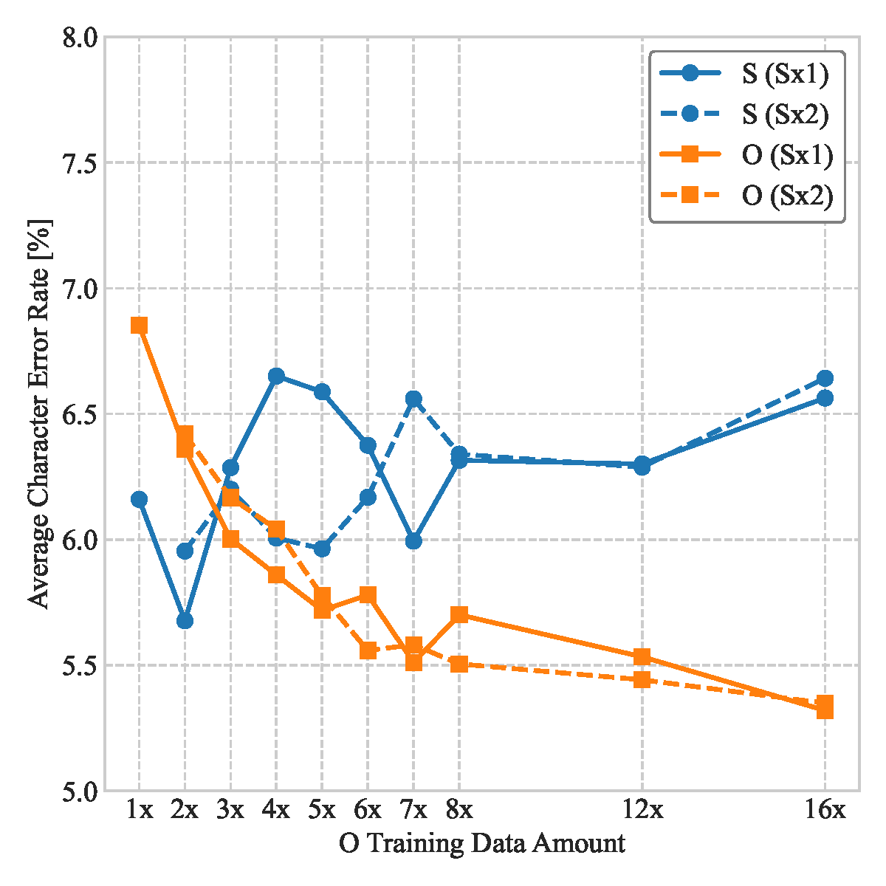
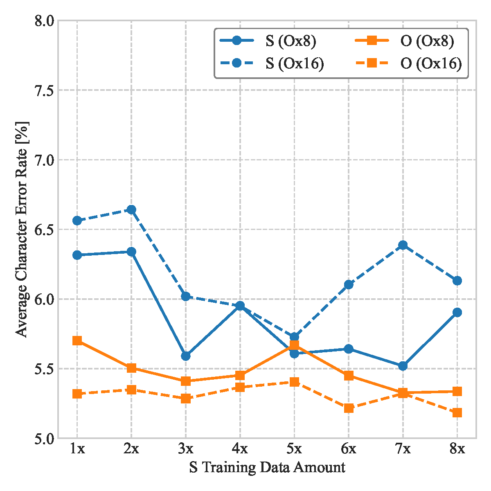
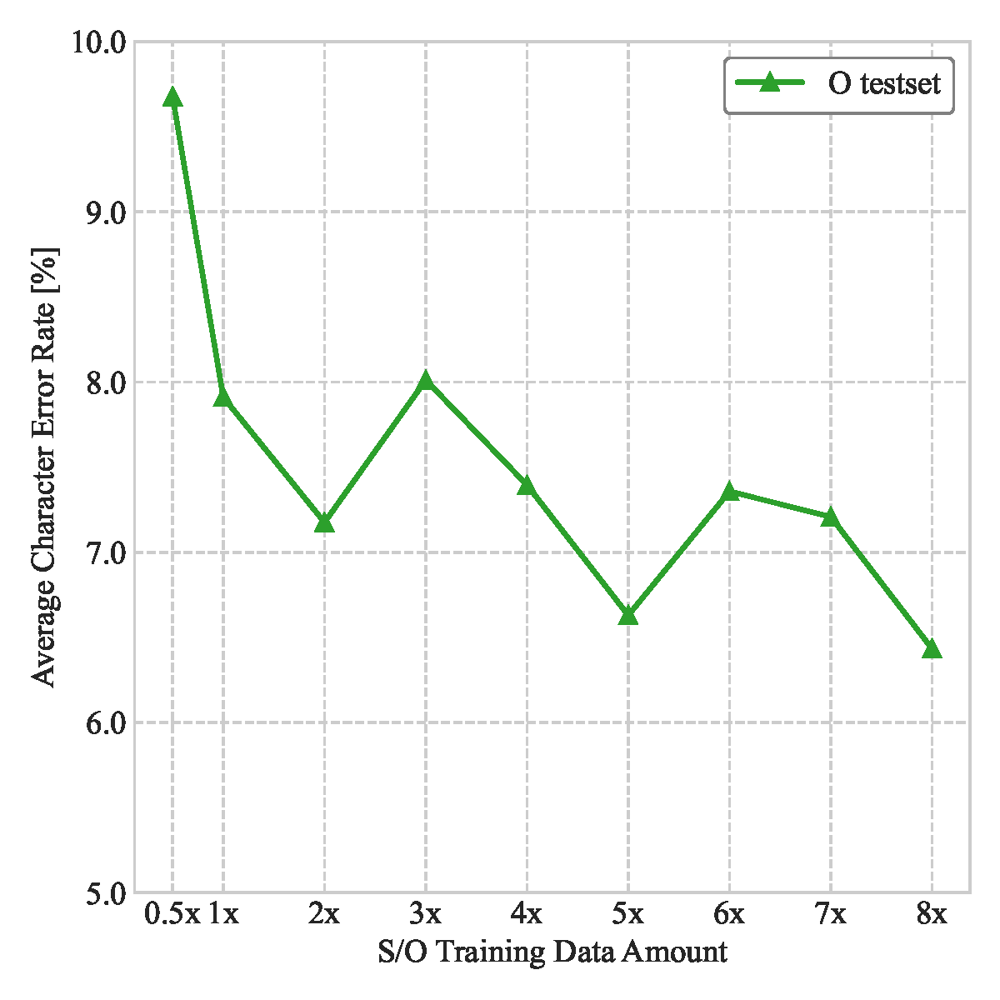

# Supplementary Results: Effect of Training Dataset Size and Composition

These results extend Sections IV-A.6 and IV-B of the paper. All models are Ns-LLMs based on Gemma2-S-9B, used with Whisper large-v3-turbo. The dataset labels ($`\mathrm{Sx}j`$, $`\mathrm{Ox}k`$) and their sizes are given in `dataset_details.md`.

## Internal evaluation

Figures S1 and S2 show the results on the 142 S and 510 O validation records of the internal evaluation (Section IV-A of the paper).

### Figure S1: Effect of the O dataset size on CER with the S dataset size fixed

Fixing the S data at Sx1 or Sx2, we compared the CERs obtained by training with the O data scaled by factors of 2, 3, ..., 8, 12, 16. Increasing the amount of O data decreases the CER for O records (orange lines) in both the Sx1 (solid) and Sx2 (dashed) cases, as observed for the joint scaling in the paper. In contrast, the CER for S records (blue lines) eventually worsens, although it temporarily decreases in some cases. This is presumably because increasing the amount of O data while keeping that of S data fixed relatively reduces the opportunity to learn the colloquial expressions of S records. Nevertheless, these CERs remain at least 3 percentage points lower than the S-record CER of 9.79% obtained with O records only (Ox2 in the paper), which indicates the importance of including a certain amount of S data.

### Figure S2: Effect of the S dataset size on CER with the O dataset size fixed

Fixing the O data at Ox8 or Ox16, we compared the CERs obtained by training with the S data scaled by factors of 1, 2, ..., 8. In both the Ox8 (solid) and Ox16 (dashed) cases, the CER for O records remains almost flat, whereas the CER for S records tends to improve as the amount of S data increases up to around 3x to 5x, beyond which no clear further improvement is observed and the CER eventually worsens.

### Summary of Figures S1 and S2

Together with the joint-scaling results in the paper, these findings indicate that increasing the amounts of both S and O data is the most effective way, among the evaluated strategies, to achieve low CERs for both record types. When the available amount of data or the training cost is constrained, keeping the number of S records at approximately 25–50% of the number of O records serves as an empirical guideline under the evaluated conditions.

## External evaluation

Figure S3 shows the results on the 100 synthetic test records of the external evaluation (Section IV-B of the paper).

### Figure S3: Effect of jointly scaling the S and O dataset sizes on CER for the synthetic test records

We evaluated the change in CER when the amounts of S and O data are scaled jointly ($`\mathrm{Sx}k`$, $`\mathrm{Ox}k`$). No correction failures were observed, and hence no samples were excluded from the computation of the averages. As with the results for O records in the internal evaluation, the CER on the synthetic test records tends to decrease as the amount of training data increases, reaching 6.43% for the Sx8, Ox8 dataset (the 8x model in Table II of the paper). Compared with the CER for O records in the internal evaluation at the same training dataset size, however, the CER is approximately 1 percentage point higher: 7.91% versus 6.85% for the Sx1, Ox1 dataset, with a gap of similar magnitude for the Sx8, Ox8 dataset. This gap may reflect differences between the records used in the internal evaluation and the independently constructed synthetic test records.
